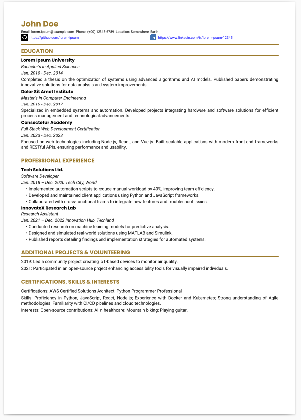

# Resume PDF Generator
This project provides a script to generate a PDF resume using Python and the ReportLab library. It allows for customizable fonts, colors, layouts, and sections. You can easily integrate your own data, fonts, and images to create a professional-looking PDF resume.

<p align="center">
  
</p>

## Features
- **Customizable Data Source**:  
  Resume data is stored in a Python dictionary (`RESUME_DATA`) that you can edit to include your personal information, education history, work experience, projects, and more.

- **Theming and Branding**:  
  Change fonts, colors, and layout by modifying the styles defined in the code. By default, it uses custom fonts (Roboto and Poppins) and a highlight color, but you can register other fonts and adjust the formatting as desired.
- **Sections Included**:  
- Header (name, contact info, GitHub and LinkedIn links with icons)
- Education (institutions, degrees, dates, and descriptions)
- Professional Experience (companies, roles, periods, and bullet-pointed responsibilities)
- Additional Projects & Volunteering (community and personal projects)
- Certifications, Skills & Interests
- **Clickable Links**:  
GitHub and LinkedIn URLs are clickable inside the PDF, directing readers to your profiles.
- **Assets Directory**:  
The script expects fonts and image assets (like icons) inside an `assets` directory. Adjust the code or directory structure as needed.
## Requirements
### Python 3.6+
### ReportLab library:
- Install via `pip install reportlab`
### Fonts and Icons:
- Make sure to have the required font files (e.g., Roboto-Regular.ttf, Poppins-Regular.ttf) and icon images (github.png, linkedin.png) placed in the assets directory.
- Update the script if your fonts or icon filenames differ.

## How to Use
1. **Clone or Download the Repository:**

   ```bash
   git clone https://github.com/OrlandoFon/Resume-Creator-With-Python.git
   cd Resume-Creator-With-Python

2. **Install Dependencies:**

   ```bash
   pip install reportlab

3. **Customize Data and Styles:**

- Open the Python file and update RESUME_DATA with your personal details.
- Adjust fonts and colors in the STYLE CREATION section if needed.
- Ensure your assets folder has the font files and icons.

4. **Generate the PDF:**

    ```bash
    python resume_generator.py
   
## Customization Tips
- **Fonts**:

- To use your own fonts, place .ttf files in assets and register them by calling:

    ```bash
    pdfmetrics.registerFont(TTFont('YourFontName', os.path.join(ASSETS_DIR, 'YourFontFile.ttf')))
    
- Then, update the font variables (e.g., NAME_FONT, NORMAL_TEXT_FONT) to your chosen font names.

- **Colors**:  

- Change HIGHLIGHT_COLOR or TEXT_COLOR to match your branding or personal preference:

    ```bash
    HIGHLIGHT_COLOR = colors.HexColor('#123456')
    TEXT_COLOR = colors.black     

- **Layout and Sections**:  

- Modify the section functions (add_header, add_education_section, etc.) if you need a different layout or want to add/remove sections.

## Contributing
- If you find issues or want to enhance functionality, feel free to open an issue or submit a pull request on the GitHub repository.

# License
- This project is licensed under the MIT License - see the [LICENSE](LICENSE) file for details.
